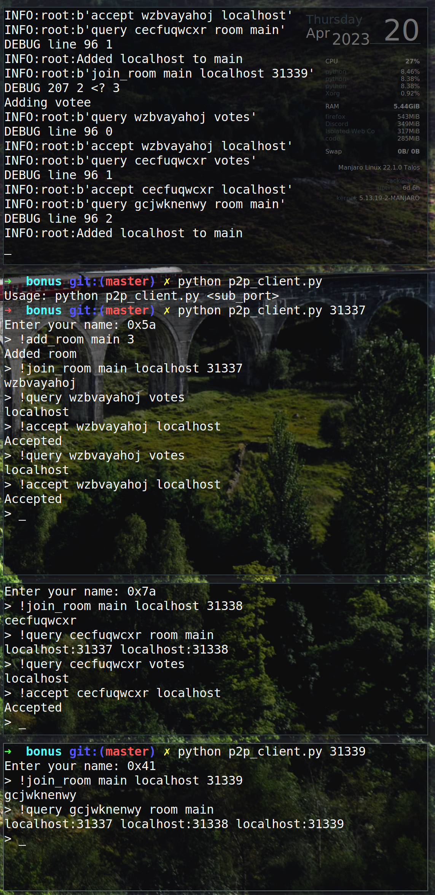
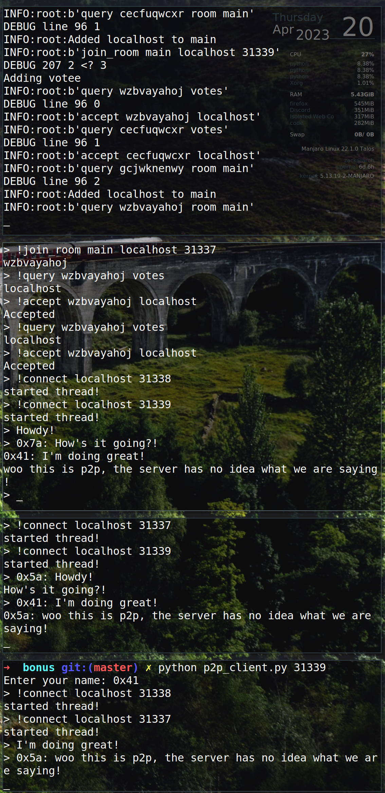

# P2P Chat Server using ZeroMQ

This is a P2P chat server that uses ZeroMQ servers. The way the process works is that the server holds information about the clients in which only new clients once they have been voted in can view.

The rules we need to satisfy are:

Rules

- Chat clients do not need to have prior IP information of other chat clients.
- Chat content must be 100% P2P. I.e. chat content must not go through a 3rd party server.
- All parties in chat must agree to all additional peers.

To set up this process a client will `!add_room <room_name> <room_size>`. Other clients will then try to join this room by doing `!join_room <room_name> <my-ip> <my-port>`. The client has a publishing service on the port that it sends to the server. Other clients will subscribe to this service and receive messages that the client sends. Once a client attempts to join a room, they will be given a randomly generated 10 character password. This password will give them access to the `query` command and the `accept` or `reject` command. Once someone has been voted in the room, they can subscribe to a client and the idea is that the other client(s) will subscribe to the new ones.

Here are some screenshots depicting the process. (To find the order you will have to check the server that is logging (top terminal))

### Specifically below is the process of voting and allowing new clients in the room

### This just shows the chat functionality once all clients are in the room

### Note
the p2p_client.py was supposed to be a nice client that handled all the server logic so all the client had to do was type a nice simple command, but time did not allow me to make a nice one before the due date.
